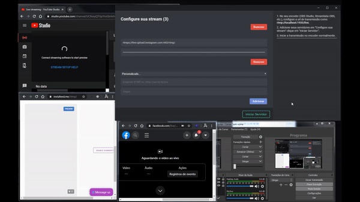

# Multistream 

## Why Multistream?
Multistream is a way to stream to multiple platforms at the same time, a feature that is not available on some broadcasters (such as OBS Studio, for example).

## Usage
After installing the version for windows (soon, multiplatform), open and add as many streams as you want. Now, in your broadcast software, set the server url to `rtmp://localhost:1935/live` in the stream settings (make sure port 1935 is not in use) and leave the stream key empty. Now, in Multistream, click on "Start Server". Start the stream normally in your streaming software, like OBS Studio.

## Por que multistream?  
Essa é uma maneira de transmitir para várias plataformas ao mesmo tempo, um recurso que não está disponível em alguns softwares de streaming (como o OBS Studio).  
  
## Modo de usar
Após instalar a versão para Windows (em breve, multiplataforma), abra a aplicação e adicione quantos servidores desejar. Agora, no seu software de transmissão, defina o URL do servidor como `rtmp://localhost:1935/live` nas configurações de stream (verifique se a porta 1935 não está em uso) e deixe a chave da stream vazia. Agora, no Multistream, clique em "Iniciar servidor". Inicie o fluxo normalmente no seu software de streaming, no OBS Studio, por exemplo, a stream é inicializada em "Iniciar Transmissão".
